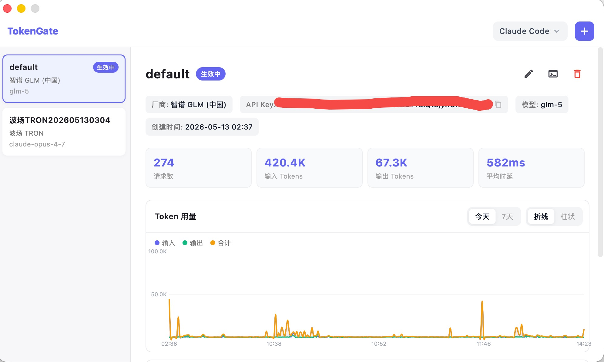
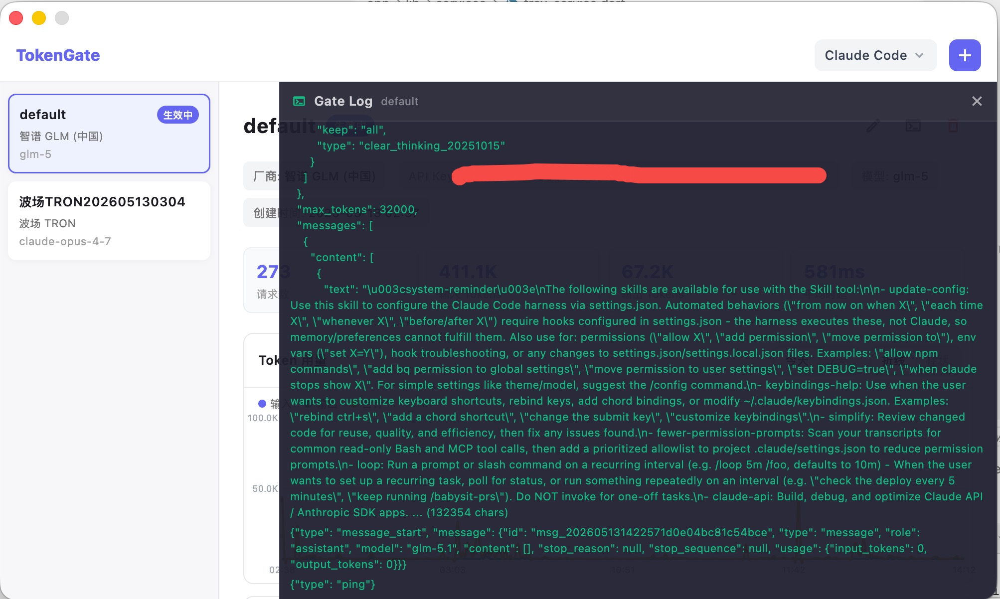

# Token Gate

本地 Claude API 代理网关，为 AI 编程工具（Claude Code、Cursor 等）提供多 Key 管理、实时切换和 Token 用量可视化。

## 功能

- **多 API Key 管理** — 存储来自 Anthropic、智谱、DeepSeek、Kimi 等供应商的密钥
- **实时切换** — 会话中途切换供应商或模型，下一个请求即时生效，无须新开会话
- **Token 用量可视化** — 查看每个配置的请求数、输入/输出 Token 数量和时延趋势
- **实时日志** — 逐行查看代理转发的请求和响应内容
- **状态栏显示** — macOS 菜单栏实时显示 Token 消耗

## 截图



实时日志


## 安装

### macOS（Homebrew）

```bash
brew tap simpossible/tap
brew install --cask token-gate
```

### macOS（手动下载）

从 [GitHub Releases](https://github.com/simpossible/token_gate/releases/latest) 下载 DMG，双击打开，将 TokenGate 拖入 Applications 文件夹。

首次打开时，macOS 可能会提示"无法验证开发者"。右键点击应用 → 选择"打开" → 点击"打开"确认即可。

## 使用

启动后在状态栏找到 TokenGate 图标，点击打开主界面：

1. 点击右上角 **+** 按钮，添加 API 配置（选择厂商、填写 API Key、选择模型）
2. 双击左侧列表中的配置即可激活
3. 激活后，Claude Code 的下一个请求自动使用新的 API Key 和模型

### 支持 AI 工具

| 工具 | 状态 |
|------|------|
| Claude Code | 已支持 |
| Cursor | 暂不支持 |
| 更多工具 | 通过 Agent 扩展机制接入 |

## 工作原理

```
AI 编程工具 (Claude Code / Cursor)
        │
        ▼
  Token Gate 代理 (127.0.0.1:12121)
        │
        ├─ 注入当前激活的 API Key
        ├─ 替换请求中的模型字段
        ├─ 透传 SSE 流式响应
        └─ 异步解析并记录 Token 用量
        │
        ▼
   上游 API（api.anthropic.com 或任意供应商）
```

| 端口   | 用途             |
|--------|-----------------|
| 12121  | API 代理         |
| 12122  | 配置管理 API     |

所有端口仅绑定 `127.0.0.1`，数据不离开本机。

## 从源码构建

需要 Go 1.21+ 和 Flutter 3.x。

```bash
git clone https://github.com/simpossible/token_gate.git
cd token_gate

# 构建 Flutter 桌面应用（自动编译 Go 二进制）
cd server && make app

# 或仅构建 Go 二进制
cd server && make build
```

## 技术栈

- **桌面应用** — Flutter (macOS)，内嵌 Go daemon
- **代理后端** — Go，SQLite，HTTP 反向代理
- **状态栏** — tray_manager，实时 SSE 事件推送

## 许可证

MIT
